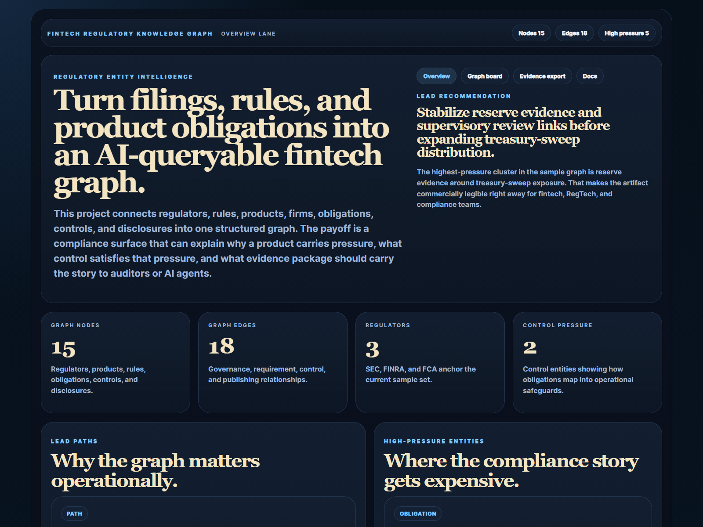
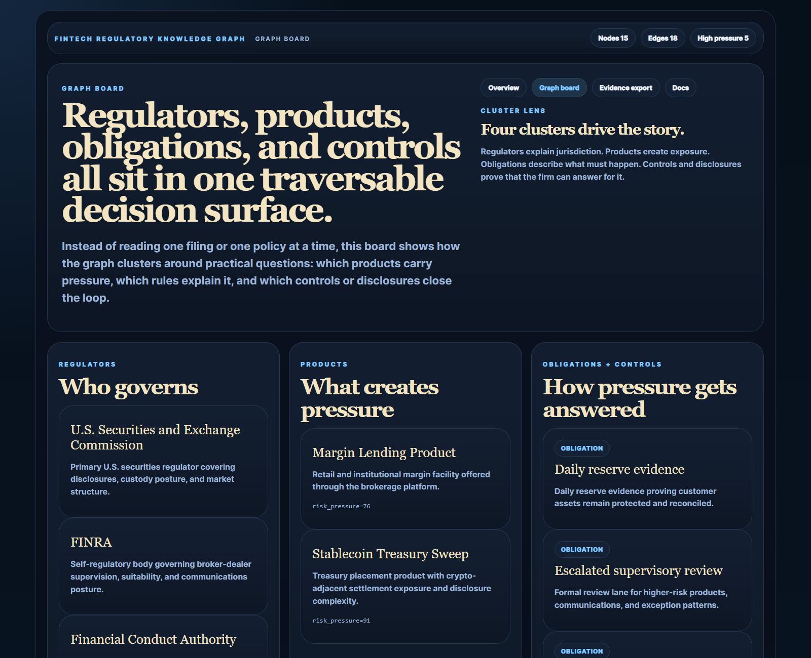
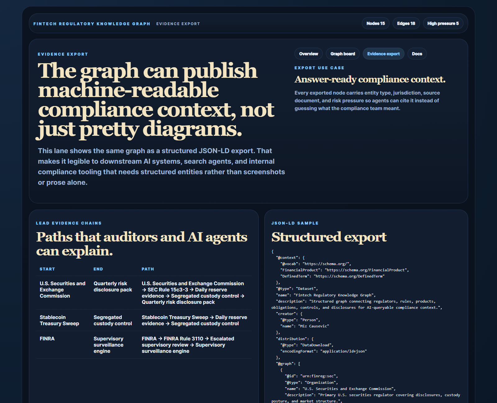
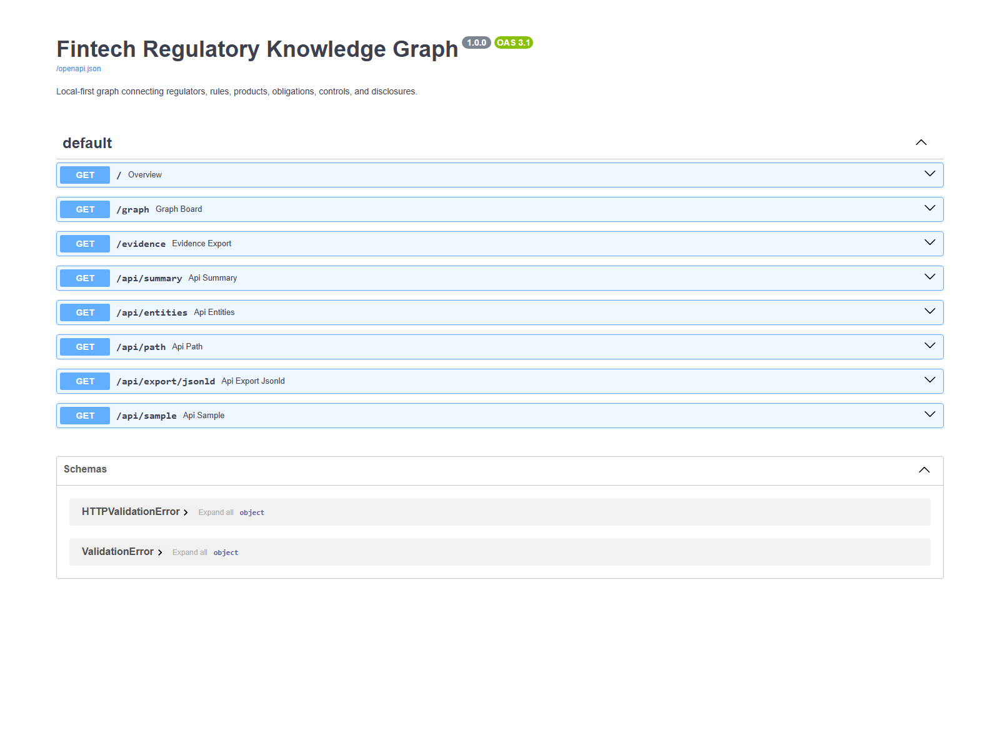

# Fintech Regulatory Knowledge Graph

Knowledge graph for fintech regulatory entities, obligations, disclosures, and AI-queryable compliance context.

## Why this repo is good

- It turns fintech compliance into a structured entity problem instead of a document pile.
- It connects regulators, rules, products, obligations, controls, and disclosures in one traversable model.
- It exports JSON-LD so downstream AI systems can consume machine-readable compliance context.
- It complements `payment-event-ledger-eos`, `pulumi-pci-dss-baseline`, and `otel-fraud-signal-tracer` as part of a stronger fintech cluster.

## Screenshots






## What it does

- seeds a local graph of regulators, rules, firms, products, obligations, controls, and disclosures
- exposes graph summaries and entity filters through FastAPI routes
- resolves explainable relationship paths between high-risk products and control evidence
- exports the graph as JSON-LD for AI-queryable compliance context
- presents a polished HTML proof surface for overview, graph board, and evidence export

## Local run

```powershell
Set-Location "C:\Users\chaus\dev\repos\fintech-regulatory-knowledge-graph"
py -3.11 -m pip install -r requirements.txt
py -3.11 -m app.main
```

Open:

- `http://127.0.0.1:4591/`
- `http://127.0.0.1:4591/graph`
- `http://127.0.0.1:4591/evidence`
- `http://127.0.0.1:4591/docs`

If the port is busy:

```powershell
$env:PORT = "4595"
py -3.11 -m app.main
```

## Validation

```powershell
py -3.11 -m pip install -r requirements.txt
py -3.11 -m pytest tests
py -3.11 scripts\run_demo.py
```

## API routes

- `GET /api/summary`
- `GET /api/entities?node_type=regulator`
- `GET /api/path?start=sec&end=risk-disclosure-pack`
- `GET /api/export/jsonld`
- `GET /api/sample`

## Repo anatomy

- [app/main.py](./app/main.py)
- [app/models.py](./app/models.py)
- [app/data/sample_graph.py](./app/data/sample_graph.py)
- [app/services/graph_service.py](./app/services/graph_service.py)
- [docs/architecture.md](./docs/architecture.md)
